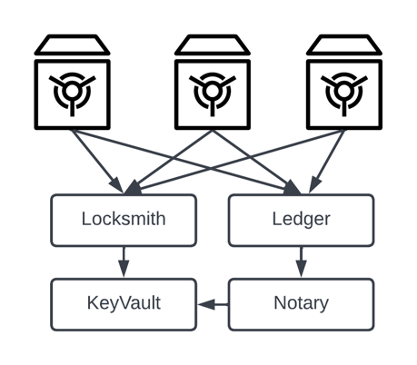

# 💎 Collateral

## Design Ethos

Supporting composability and increasing security requires  collateral to be stored in contracts provided by the user. The `KeyVault`, `Locksmith`, `Notary`, and `Ledger` provide a permission and asset ledger system that Vaults can leverage for facilitating deposits, storage, and withdrawals.

Each `ICollateralProvider` will take two explicit Locksmith infrastructure dependencies:

1. `ILocksmith`. The implementation requires that the vaults can enforce key permissions. The Locksmith interface instance is used to determine if the message senders into the vault are in possession of the required key.&#x20;
2. `ILedger`. Each vault transaction results in a deposit or a withdrawal on the Ledger. The Ledger will keep track of key balances and total collateral balance, which is verified-or-reverted by the vault in any discrepancy. Internal contract balances are managed to avoid `selfdestruct` jamming but contract balance can also in-variant protected.

<figure><figcaption><p>Collateral Providers use the NFT contract and the Ledger.</p></figcaption></figure>

The `ICollateralProvider` interface is very simple, and only supports gaining access to the Ledger reference and the ability to withdrawal an asset amount using a specific key.

```solidity
interface ICollateralProvider {
    /**
     * getTrustedLedger
     *
     * This interface must publicly expose the ledger it respects
     * to manage key distribution rights.
     *
     * @return the address of the ILedger powering the provider's key-rights.
     */
    function getTrustedLedger() external view returns (address);

    /**
     * arnWithdrawal
     *
     * Takes an ARN and sends it back to the caller. This vault will fail
     * the withdrawal if it was never deposited as it wont recognize the arn.
     *
     * @param keyId  the key you want to use to withdrawal with/from
     * @param arn    the asset resource name to withdrawal
     * @param amount the amount, in gwei, to withdrawal from the balance.
     */
    function arnWithdrawal(uint256 keyId, bytes32 arn, uint256 amount) external;
}
```

There are two default collateral provider implementations that we will cover, along with how assets move between keys in this section.
